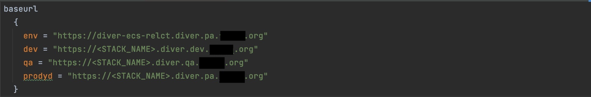
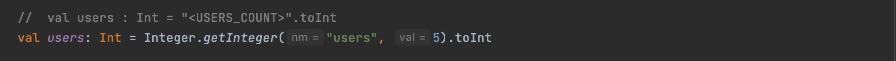
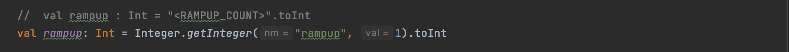
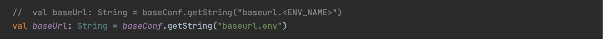
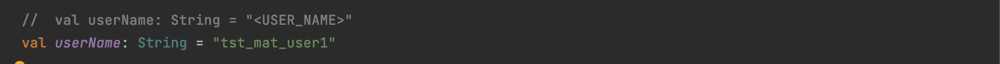
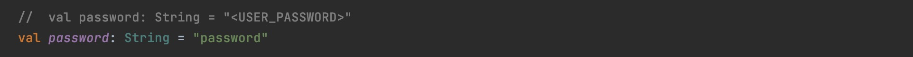
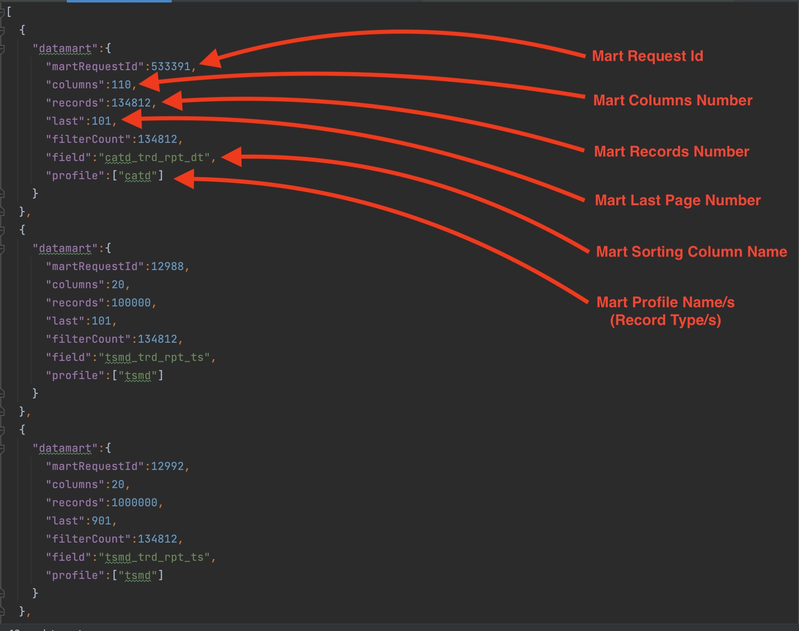
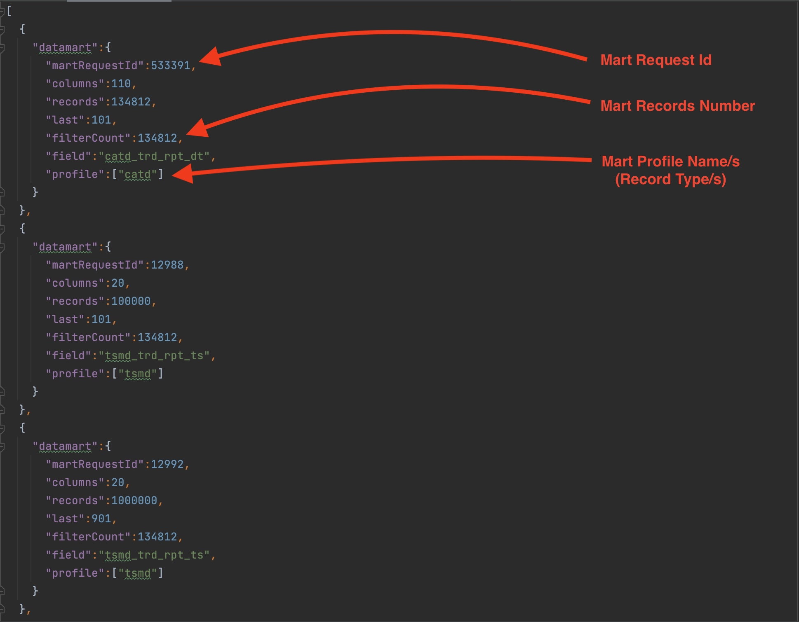

# Gatling Performance Framework

`git clone https://github.com/mbeider/test-performance-diver.git`

### Installation

### Change directory to performance framework:
`cd test-performance-diver`

### Modify "baseurl.env" in "src/test/resources/application.conf" file in order to run on different environment :

### Modify "src/test/scala/config/Configuration.scala" file in order to run locally:

### Compile framework with Maven:
`mvn -X clean install`

## Running Materialization Post Request
### Execution:
`mvn gatling:test -Dgatling.simulationClass=simulations.PostMaterializationSimulation`

## Running View Post Request
### Modify "src/test/resources/datamarts.json" file in order to run current datamarts:
  

### Execution:
`mvn gatling:test -Dgatling.simulationClass=simulations.ViewSimulation -Dcolumns=20 [100] [300] -Drecords=100000 [1000000] [3500000] [4000000] [5000000] [6000000] [7000000] -Dpage=Last [last] [LAST] [l] [L] [First] [first] [FIRST] [f] [F] -DsortOrder=ASC [asc] [a] [DESC] [desc] [d]`

## Running Export CSV Process
### Modify "src/test/resources/datamarts.json" file in order to export current datamarts:

### Execution:
`mvn gatling:test -Dgatling.simulationClass=simulations.PostExportSimulation -DmartRequestId=533391`

# Performance test results
* Gatling test results located in "target/gatling/results" folder
